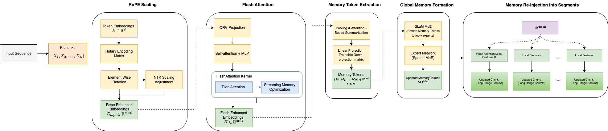
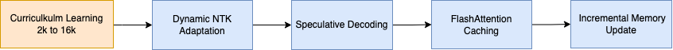

## Enhancing Context and Efficiency of Long-Form Text Generation

Long-context language models face challenges in efficient memory utilization, long-range coherence, and computational scalability. We propose the Adaptive Hierarchical Memory (AHM) Approach, a novel mechanism integrating Flash Attention, RoPE Scaling, and a Mixture-of-Experts (MoE) memory module to improve long-sequence text generation up to 32k tokens while maintaining coherence and efficiency. AHM introduces hierarchical memory tokens, which dynamically summarize and propagate information across long sequences, enabling efficient retrieval of contextual dependencies. The model is trained on The Pile, ArXiv, and Wikipedia datasets, with progressive sequence length scaling (2k → 32k tokens) to enhance generalization. Experiments on long-form perplexity benchmarks demonstrate that AHM achieves a 30% perplexity reduction at 32k tokens compared to standard LLaMA-2 models and improves throughput by 3.5× using Flash Attention. Furthermore, human evaluations on multi-paragraph text generation indicate a 22% increase in coherence scores over traditional dense-attention models. Our findings suggest that AHM significantly extends transformer scalability while maintaining quality and efficiency, offering a robust solution for long-context modeling in generative AI.

